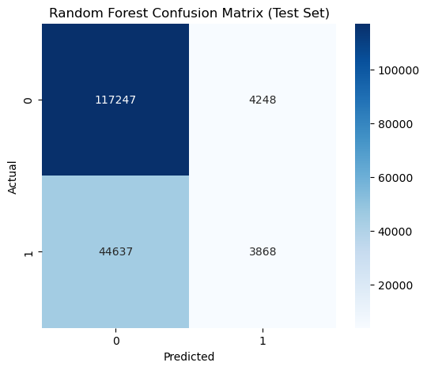
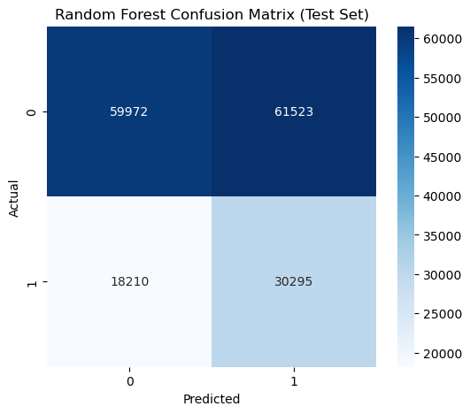
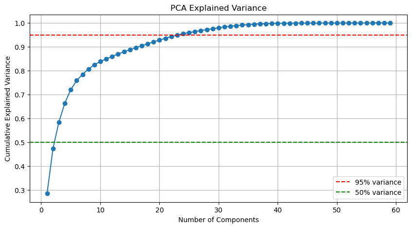
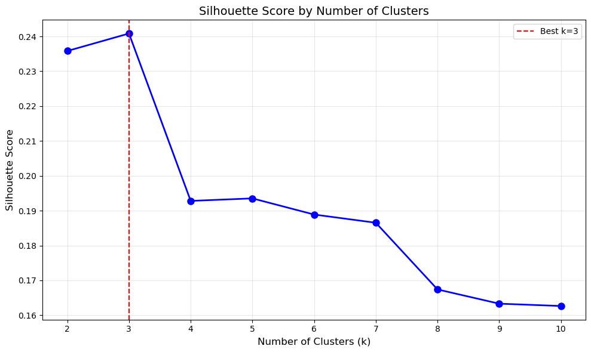
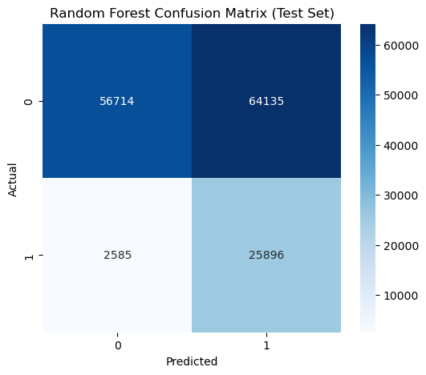
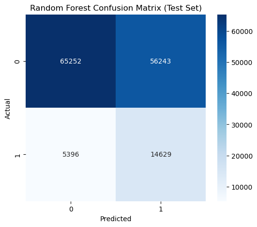
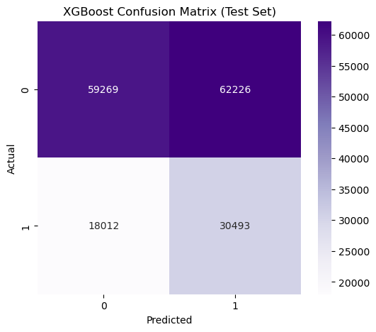
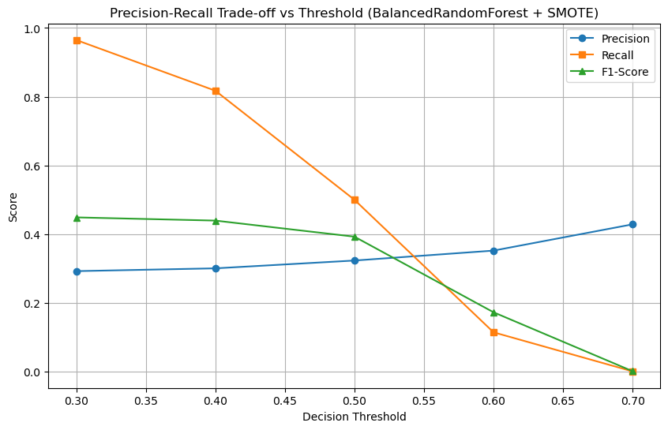

# DSE 220: Project on Employee Burnout Turnover Prediction

Group members: 
- Grant Wagener (gwagener@ucsd.edu)
- Duy Nguyen (dnn007@ucsd.edu)
- Thomas Brehme (tbrehme@ucsd.edu)


## Table of Content:
- [Abstract](#abstract)
- [Dataset](#dataset)
- [Methods](#methods)
- [Results](#results)
- [Discussion](#discussion)
- [Conclusion](#conclusion)
- [References](#references)


## Abstract:
This project will use the Employee Burnout & Turnover Prediction Dataset (~850,000 records) from HuggingFace to study the problem of predicting employee turnover. The primary task is a supervised classification problem: given demographic, role, workload, sentiment, and performance features, we want to model the probability that an employee leaves the company. Our approach will begin with tabular baselines (e.g., logistic regression, tree-based models) and extend to multi-modal models that incorporate both structured and textual features. Model performance will be evaluated with standard classification metrics, and interpretability methods (e.g., feature importance) will be applied to identify key predictors of turnover. For a secondary analysis, we may also explore turnover reason. This dataset provides both scale and feature diversity, making it well-suited to our goal of building predictive and interpretable machine learning models.


# Introduction

Employee turnover remains one of the most difficult issues facing organizations today. In a labor market marked by mobility and changing needs, employers face increasing pressure to retain key talent. The economic stakes to retention are substantial: research shows that replacing an employee can cost between 20% and 200% of the employee’s annual salary, depending on the role’s specialization and seniority (Boushey & Glynn, 2012). Additionally, turnover imposes indirect costs including productivity loss, reduced morale, and loss of institutional knowledge. As a result, predicting employee attrition is an important area of research with real economic consequence.

From a machine learning perspective, turnover prediction is a compelling problem due to its complexity. Ultimately, the choice to leave a job is a decision that is highly dependent on each individual person and does not only include factors about the job but also external factors including job market and their personal life. The problem of turnover prediction is further complicated by the lack of sufficient data. Few companies possess a sufficiently large dataset to train complex models. Real-world HR datasets are typically small or unavailable due to privacy and legal constraints, limiting the development of machine learning models.

To address this gap, this project uses the Employee Burnout & Turnover Prediction Dataset released on HuggingFace. Although the dataset is synthetic, it was constructed to mirror real-world statistical distributions. It captures realistic patterns in employee demographics, workload characteristics, sentiment features, and attrition. Synthetic data allows for the exploration of turnover modeling with more observations without the privacy risks associated with real HR data. The dataset’s combination of structured and text fields allows for complex models to predict turnover.

The broader impact of developing effective turnover prediction extends beyond an exercise in ML model development. Accurate and interpretable models can help organizations identify systemic issues contributing to attrition and make the necessary plans to mitigate the costs of turnover.


## Dataset: 
**employee-burnout-turnover-prediction800**

    - Author: BrotherTony
    - Title: Synthetic Employee Dataset: 800K+ Records for HR Analytics
    - Year: 2025
    - Publisher: Hugging Face
    - URL:https://huggingface.co/datasets/BrotherTony/synthetic-employee-dataset


**Quick Information (from dataset website):**
- Total Records	800,000+
- Departments	38 unique divisions
- Job Roles	300+ distinct positions
- Employee Personas	12 behavioral archetypes
- Features per Record	30+ attributes
- Salary Range	$27K - $384K


# Methods 

## Requirements and Run Instuctions
Below are reproducible steps to set up a local environment and install the packages required to run the exploratory notebook.

Minimum requirements
- Python 3.12+
- ~2 GB free disk for a minimal environment; more RAM is recommended to load the full dataset (dataset ~850k rows, 1.3 GB)

Recommended setup (virtual environment)

```bash
# create virtual environment
python3 -m venv .venv
source .venv/bin/activate
# upgrade pip
python -m pip install --upgrade pip
```

Install the core Python packages used by the notebook:

```bash
pip install pandas numpy seaborn matplotlib jupyterlab notebook scikit-learn imbalanced-learn nltk xgboost
```

You can also create a `requirements.txt` file containing the above packages and run `pip install -r requirements.txt` to reproduce the environment.

Notes:
- If you prefer Conda, create an environment with `conda create -n dse220 python=3.12` then `conda activate dse220` and use `pip` or `conda` to install packages.
- If you prefer to download the dataset, the code expects the relative path to the dataset is `data/employee-burnout-turnover-prediction-800k/synthetic-employee-dataset.json` (the notebook expects that relative path).
- If you prefer to not download the dataset and load it directly from Hugging Face, use this after using huggingface-cli:

```
# Login using e.g. `huggingface-cli login` to access this dataset
df = pd.read_json("hf://datasets/BrotherTony/employee-burnout-turnover-prediction-800k/synthetic-employee-dataset.json")
```

This project consists of three main notebooks:
1. **`EDA.ipynb`**: Exploratory Data Analysis and data preprocessing
2. **`Model1.ipynb`**: Machine learning model training and evaluation
3. **`Model2.ipynb`**: Second machine learning model, improvements, and evaluation

All notebooks use IPython's `%store` to share variables between them. **`EDA.ipynb`** must be run before **`Model1.ipynb`** or **`Model2.ipynb`**.


## Exploratory Data Analysis

Found in **`EDA.ipynb`** is out data exploration. After loading employee-burnout-turnover-prediction800 we fined the dataset cointains 849,999 observations, representing synthetic employee records. The dataset includes a mix of catagorical an continuous variables. 

Feature Colunms and descriptions:
 - *`employee_id`*: Unique synthetic identifier
- *`role`*: Job title (300+ varieties)
- *`job_level`*: Entry | Mid | Senior | Manager | Lead
- *`department`*: Business unit (38 departments)
- *`tenure_months`*: Time with company (1-357 months)
- *`salary`*: Annual USD ($27K-$3384K range)
- *`performance_score`*: Normalized 0-1 rating
- *`satisfaction_score`*: Employee happiness (0-1)
- *`workload_score`*: Workload burden indicator
- *`team_sentiment`*: Team morale (0-1)
- *`recent_feedback`*: Employee's anonymous assessment of company
- *`communication_patterns`*: Persona-based style
- *`project_completion_rate`*: Delivery success metric
- *`overtime_hours`*: Extra hours logged (0-74 range)
- *`training_participation`*: L&D engagement
- *`collaboration_score`*: Teamwork rating
- *`technical_skills`*: Array of tech skills (4-9 per employee)
- *`soft_skills`*: Array of soft skills (3-7 per employee)
- *`email_sentiment`*: Email tone analysis
- *`slack_activity`*: Chat platform usage
- *`meeting_participation`*: Meeting engagement
- *`goal_achievement_rate`*: Objective completion
- *`stress_level`*: Stress assessment (0-1)
- *`burnout_risk`*: Burnout probability (0-1)
- *`left_company`*: Boolean exit flag
- *`turnover_reason`*: Exit category (if applicable)
- *`risk_factors_summary`*: Low | Medium | High | Severe risk
- *`turnover_probability_generated`**: ML-predicted churn risk
- *`persona_name`*: Type of employee 
- *`role_complexity_score`*: Job difficulty rating
- *`career_progression_score`*: Growth trajectory


Categorical feature columns: 
- role, job_level, department, communication_patterns, technical_skills, soft_skills, left_company, risk_factors_summary, persona_name

Continuous numerical feature columns:
- tenure_months, salary, performance_score, satisfaction_score, workload_score, team_sentiment, project_completion_rate, overtime_hours, training_participation, collaboration_score, email_sentiment, slack_activity, meeting_participation, goal_achievement_rate, stress_level, burnout_risk, turnover_probability_generated, role_complexity_score, career_progression_score

Targets:
- `left_company`. This is the Boolean column that determines whether an employee has left the company or not. Since we want to model the probability that an employee leaves the company, this is the key target column.
- `turnover_reason`. This list the reason the empolyee left the company. This will be used as a psuedo-label for an unsupervised learning appoach. 

There is no duplicate observation. There are some missing data such as various labels indicating the same missing data (Anonymous Employee, Current Employee - Anonymous Employee, " ", ...) for the _role_ column. Another example is "Not Applicable" in _turnover_reason_ column.

We start our exploration by looking at the correlations amongst the numerical features. Below is a correlation heatmap from our dataset:


The correlations show that high `workload_score` is directly linked to high `stress_level` and `burnout_risk`. These burnout factors are strongly negatively correlated with satisfaction_score and performance_score, and positively linked to a higher `turnover_probability_generated`. There's a logical connection between longer `tenure_months` and a `higher career_progression_score`. `stress_level` and `burnout_risk` are strongly correlated to each other (0.99-1.00). We are dropping stress_level and keeping burnout_risk. `performance_score`, `goal_achievement_rate`, and `project_completion_rate` are all highly correlated to each other (0.95-1.00), so we're using only one, `performance_score`, and drop the two others. `slack_activity`, `meeting_participation`, and `collaboration_score` are all extremely related (mostly 1.00). We're keeping `collaboration_score` and dropping `slack_activity` and `meeting_participation`. `satisfaction_score` correlates highly with `email_sentiment`, dropping `email_sentiment`.

Looking into our catagorical varibles we find they provide a realistic breakdown of role and level.

Pie chart below shows the distribution of job leves among the dataset.


 Here we can see clearly that the most common role is Mid-level career position, followed by Entry, Manager, Senior, and Lead. This follows a normal distribution with the roles that take more time or least time to achieve being much less common than the role that takes an average amount of time to achieve.


 The bar chart below shows the most common job role without missing data (Anonymous Role).


 This bar chart reveals a wide variety of job professions. Understandably, Manager is the most common role as that role exists in every industry. Remarkably, the difference in numbers in each role after the top 10 roles seem to not vary by much.

## Data Preprocessing


 **Variable Restoration**: Using IPython's `%store` magic to load preprocessed data from `EDA.ipynb`
In this notebook we removed columns with high correlations. These columns are listed in the previose section. 

After varible restoration our preprocessiong diverges in the two modeling notebooks. 

In **`Model1.ipynb`** we use one-hot encoding for categorical variables: `role`, `job_level`, `department` MinMax normalization for numerical variables: `tenure_months`, `salary`. The other continuous numerical varibles are already standardized. We then drop columns like `employee_id` that we will not use in our models trained in this notebook. We then perform an 80/20 split with stratification to maintain class balance
   - Training set: ~680K samples
   - Test set: ~170K samples
   - Target distribution: 71% stayed, 29% left

Our dataset has a significant class imbalance which we used several approaches to address: 
   - Random Oversampling (ROS)
   - Random Undersampling (RUS)
   - SMOTE (Synthetic Minority Over-sampling Technique)
   - BalancedRandomForestClassifier


In **`Model2.ipynb`** we create a new dataset which includes only observations where the employee left. There are two additional feature engineering steps in this notebook. We use a VADER sentiment score to our calculate a sentiment score based off the `recent_feedback` column. Additionally we add `salary_rank` column that assigns a percentage rank to each employee based off their `role` and `salary`. 

For our unsupervised learning approach we select only the following continuous feature columns:

```
feature_cols = ['satisfaction_score',
                'burnout_risk', 
                'collaboration_score', 
                'feedback_sentiment_score',
                'workload_score',
                'performance_score',
                'overtime_hours']
```
These features are scaled before PCA with a standared scaler

The following catagorical features are included in the PCA: 
```
categorical_vars = [ 'job_level', 'department', 'persona_name']
```
These are encoded using a one-hot encoding, much like in **`Model1.ipynb`**

Following our clustering on the PCA results the scaled feature columns and encoded catagorical columns listed above are used to run several RF models and an XGboost model. 

## Model 1 (Random Forests)

In our initial modeling approach we used a randomforset model.  We have multiple similar approaches to predicting turnover. 

### First Model: Random Forest Baseline
**Model Configuration:**
- Algorithm: Random Forest Classifier
- Hyperparameters: `n_estimators=100`, `max_depth=None`, `class_weight='balanced'`
- Training data: Oversampled with RandomOverSampler


Following completion of training and test data leakage was detected. The feature `turnover_probability_generated` was essentially a proxy for the target variable. It was removed for the following models. 

### Second Model: Random Forest with Undersampling

**Model Configuration:**
- Algorithm: Random Forest Classifier
- Hyperparameters: `n_estimators=200`, `max_depth=10`, `min_samples_split=10`, `min_samples_leaf=5`
- Training data: Undersampled with RandomUnderSampler


### Third Model: SMOTE + Feature Selection + BalancedRandomForest

**Model Configuration:**
- Algorithm: BalancedRandomForestClassifier
- Hyperparameters: `n_estimators=100`, `max_depth=10`, `min_samples_split=20`, `min_samples_leaf=10`,
- Training data: Resampled with SMOTE 

To perform SMOTE we subsampled to 50k observations for computational effeciency. 

Additionally the model was trained on a pruned feature set selected top 20 features based on importance from previous model:

```
top_features = [
    'burnout_risk', 'satisfaction_score', 'collaboration_score', 'workload_score',
    'performance_score', 'team_sentiment', 'overtime_hours', 'training_participation', 
    'career_progression_score', 'salary', 'tenure_months', 'department_Research & Development', 
    'department_Operations', 'role_ Team Member', 'department_Sales & Marketing', 'role_complexity_score',
    'role_ Data Scientist', 'department_Dairy', 'department_Technology', 'department_Procurement'
]
```

## Model 2 (PCA + KMeans continued to segmented RF and XGBoost)

`Model2.ipynb` extends the the initial analysis by performing unsupervised learning before a training a predictive model on turnover. To do this the features are reduced using PCA. Only 8 components were kept. On the principle components a KMeans (k≈3) clustering was performed to reveal dominant turnover narratives (burnout/compensation vs relocation/personal).

After the unsupervised learning a segmented model was trained. The target was split based on the `turnover_reason` for one model target only consisted of observations where the employee left for Burnout or Compensation reasons. Another model was trained on the remaining turnover reasons (Personal, Involuntary, and Career Opprotunity.) These models were trained seperatly and had the following configuration: 

**Model Configuration:**
- Algorithm: Random Forest Classifier
- Hyperparameters: `n_estimators=400`, `max_depth=10`
- Training data: Undersampled with RandomUnderSampler

Finally benchmark an `XGBClassifier` on the full dataset using the same feature set.
**Model Configuration:**
```
xgb_model = XGBClassifier(
    n_estimators=600,
    learning_rate=0.05,
    max_depth=6,
    subsample=0.8,
    colsample_bytree=0.8,
    min_child_weight=3,
    gamma=0.5,
    objective='binary:logistic',
    eval_metric='logloss',
    scale_pos_weight=scale_pos_weight,
    random_state=42,
    n_jobs=-1
)
```


# Results

## Model 1  (Milestone 3 — `Model1.ipynb`)

Here are the metrics for the models in **`Model1.ipynb`**

### **First Model: Baseline Random Forest Model**:
#
| **Metric**   | **Train Set**              | **Test Set**               |
|--------------|-----------------------------|-----------------------------|
| Accuracy     | 0.9999985294096021          | 0.7124411764705882          |
| Precision    | 0.9999948459453052          | 0.47658945293247906         |
| Recall       | 1.0                          | 0.0797443562519328          |
| F1-Score     | 0.9999974229660115           | 0.13662775295385104         |
| ROC-AUC      | 0.9999989711468421           | 0.5223899772123486          |
#


**Confusion Matrix Analysis** (Test Set):


### **Second Model: Random Forest with Undersampling**:
#
| **Metric**   | **Train Set** | **Test Set** |
|--------------|---------------|--------------|
| Accuracy     | 0.533         | 0.531        |
| Precision    | 0.332         | 0.330        |
| Recall       | 0.626         | 0.625        |
| F1-Score     | 0.434         | 0.432        |
| ROC-AUC      | 0.561         | 0.559        |
#

**Confusion Matrix Analysis** (Test Set):



### **Third Model: SMOTE + Feature Selection + BalancedRandomForest**:
#
| **Metric**   | **Train (Subsample + SMOTE)** | **Test (Subsample)** |
|--------------|-------------------------------|------------------------|
| Accuracy     | 0.668                         | 0.556                  |
| Precision    | 0.652                         | 0.323                  |
| Recall       | 0.721                         | 0.500                  |
| F1-Score     | 0.685                         | 0.393                  |
| ROC-AUC      | 0.668                         | 0.539                  |
#

## Model 2 (Milestone 4 — `Model2.ipynb`)

### **PCA: Feature reduction and explained varience**:

Below is a plot showing the varience explaince my the number of components: 


Using `n_components = 8` 
Variance explained: 80.70%

### **KMeans: Silhouette Analysis**:
Below is a plot of the silhouette analysis performed on the KMeans clustering of the PCA components: 


The clusters have the following make up of turnover reason: 

**Cluster ID: 0**
| **Reason**                               | **Count** | **Percentage** |
|------------------------------------------|-----------|----------------|
| Personal / Relocation                    | 43,478    | 56.458%        |
| Burnout / Work-Life Balance              | 12,222    | 15.871%        |
| Personal Reasons (Anomaly)               | 7,924     | 10.290%        |
| Involuntary (Performance)                | 4,639     | 6.024%         |
| Career Opportunity                       | 4,386     | 5.695%         |
| Compensation / Role Dissatisfaction      | 4,360     | 5.662%         |

**Cluster ID: 1** 
| **Reason**                               | **Count** | **Percentage** |
|------------------------------------------|-----------|----------------|
| Burnout / Work-Life Balance              | 58,283    | 55.418%        |
| Compensation / Role Dissatisfaction      | 23,934    | 22.757%        |
| Personal / Relocation                    | 18,386    | 17.482%        |
| Involuntary (Performance)                | 2,644     | 2.514%         |
| Career Opportunity                       | 1,917     | 1.823%         |
| Personal Reasons (Anomaly)               | 6         | 0.006%         |

**Cluster ID: 2**
| **Reason**                               | **Count** | **Percentage** |
|------------------------------------------|-----------|----------------|
| Burnout / Work-Life Balance              | 37,234    | 61.700%        |
| Personal / Relocation                    | 12,314    | 20.405%        |
| Compensation / Role Dissatisfaction      | 6,370     | 10.556%        |
| Involuntary (Performance)                | 1,613     | 2.673%         |
| Personal Reasons (Anomaly)               | 1,593     | 2.640%         |
| Career Opportunity                       | 1,223     | 2.027%         |


### **Segmented RF Model**: 

For the model where the target contains the reasons: “Burnout / Work-Life Balance” and “Compensation / Role Dissatisfaction" the metrics are:
#
| **Metric**   | **Train Set** | **Test Set** |
|--------------|---------------|--------------|
| Accuracy     | 0.694         | 0.553        |
| Precision    | 0.634         | 0.288        |
| Recall       | 0.914         | 0.909        |
| F1-Score     | 0.749         | 0.437        |
| ROC-AUC      | 0.694         | 0.689        | 
#
The confusion matrix showing the correct predictions along with the FP and FN for this model is below:


For the model where the target contains the remaining reasons, the metrics are: 
#
| **Metric**   | **Train Set** | **Test Set** |
|--------------|---------------|--------------|
| Accuracy     | 0.635         | 0.564        |
| Precision    | 0.613         | 0.206        |
| Recall       | 0.733         | 0.731        |
| F1-Score     | 0.668         | 0.322        |
| ROC-AUC      | 0.635         | 0.634        |
#
The confusion matrix showing the correct predictions along with the FP and FN for this model is below:



### **XGboosted Model**: 

#
| **Metric**   | **XGB Train Set** | **XGB Test Set** |
|--------------|--------------------|-------------------|
| Accuracy     | 0.550              | 0.528             |
| Precision    | 0.349              | 0.329             |
| Recall       | 0.667              | 0.629             |
| F1-Score     | 0.459              | 0.432             |
| ROC-AUC      | 0.586              | 0.558             |
#
The confusion matrix showing the correct predictions along with the FP and FN for this model is below:



# Discussion

### Data Exploration and Preprocessing

We began with 850,000 employee records containing 31 features. The correlation heatmap revealed a "burnout cluster" where high workload linked to stress and burnout, which negatively correlated with satisfaction. This aligned with workplace intuition and gave us confidence in the synthetic data's realism. 

During preprocessing we dropped redundant features. For example, stress_level and burnout_risk had 0. 99 correlation, and collaboration_score, slack_activity, and meeting_participation were nearly identical.  We reduced from 31 to 25 columns to avoid multicollinearity while preserving signal.  We also identified turnover_probability_generated as data leakage since it was derived from our target variable. Although it ranked first in feature importance at 9.1%, we removed it before Model 2 to ensure valid results.

### Model 1: Iterative Random Forest Approaches

We trained three Random Forest variants to address overfitting and class imbalance.  Our first attempt used RandomOverSampler with no depth limit, achieving 99. 99% train accuracy but only 71% test accuracy with 8% recall. The 29% train-test gap showed severe overfitting from memorizing duplicated minority class examples. 

Our second attempt removed the leaky feature, applied RandomUnderSampler for 50-50 class balance, and added regularization (max_depth=10, min_samples_split=10, 200 trees). This reduced the train-test gap to nearly zero (53% train, 53% test) and improved recall to 62%.  

Our third attempt used SMOTE with BalancedRandomForestClassifier on the top 20 features with a 50K subsample. We tuned the decision threshold from 0. 5 to 0.4, achieving 82% recall with 56% test accuracy. However, test accuracy plateaued around 53-56%, suggesting the unified approach had limited signal without segmentation.

For our third model we performed some additional thresholding. We want to prioritize high Recall as this measurement emphasizes the cost of False Negative (miss identifying an at-risk employee who then quits unexpectedly).This is because this would lead to high  turnover rate and replacement costs, loss productivity, and team disruption.

We also want to prioritize Precision as this measurement emphasizes False Positive (flagging happy employees as an at-risk employee and waste resource on retention effort), albeit this usually costs less than False Negative in this case.



Based on this chart, we can use a threshold of 0.4 instead of the default 0.5 as we still have a relatively high recall and F1-Score and Precision has not gone too far down.


### Model 2: Segmented Approach with Clustering

Model 2 took a different approach, hypothesizing that different turnover reasons have distinct predictive signatures. We removed the data leakage feature and engineered salary_rank (relative pay within peer group) and feedback_sentiment_score (VADER sentiment from text). 

We filtered to departed employees (242,526 rows), applied PCA (59 features → 8 components, 81% variance), then K-Means clustering. Silhouette analysis identified K=3 as optimal.  Cluster 0 (32% of leavers) was 56% personal/relocation exits (unavoidable).  Clusters 1 and 2 (68% of leavers) were dominated by burnout and compensation issues (preventable).

We built two Random Forests with RandomUnderSampler and regularization (max_depth=10, 400 trees). Model 2A (preventable turnover) achieved 55% test accuracy with 91% recall and 69% ROC-AUC, catching 9 out of 10 at-risk employees though precision was only 29%. This high recall was our primary goal since missing a departure is far more costly than a false alarm.  Model 2B (unavoidable turnover) achieved 56% accuracy with 73% recall. We also benchmarked with XGBoost on the full dataset, which achieved 53% accuracy and 58% ROC-AUC, validating that our segmented strategy outperformed unified modeling by 11 percentage points for the preventable cohort.

### Feature Importance

Top predictors across models were satisfaction_score, burnout_risk, collaboration_score, and feedback_sentiment_score. The engineered features proved valuable: salary_rank captured relative compensation dissatisfaction, and feedback_sentiment_score from text analysis ranked highly in aggregate importance. The consistency of these predictors and their alignment with HR intuition gives us confidence in the results.

### Limitations

Several limitations constrain our results. First, the data is synthetic and cannot fully capture real workplace complexity. Second, Model 1's initial severe overfitting (29% train-test gap) required multiple iterations to fix. Model 2 still shows moderate overfitting (14% gap). Third, low precision means 71% of flagged employees in Model 2 are false positives, which could lead to wasted HR resources on employees who were not actually at risk.  Fourth, we used a single 80-20 split rather than cross-validation due to time constraints. Finally, our model predicts who might leave but not when, limiting operational value. 

### Why Results Are Still Valuable

Despite limitations, this project demonstrates proof of concept. The segmented approach in Model 2 achieved 91% recall for preventable turnover, successfully identifying nearly all at-risk employees in the burnout and compensation cohorts. Most importantly, clustering revealed that 68% of departures stem from preventable causes. If an organization reduced preventable turnover by 20% through targeted interventions, the ROI would be substantial given replacement costs of $50K-$150K per employee.

The key insight is that employee turnover is not monolithic. Different exit reasons have different warning signs, and segmented modeling respects that structure. This approach demonstrates clear value over unified baseline methods that failed to capture these distinct patterns. 


# Conclusion

`Model2.ipynb` demonstrated that segmenting employees by turnover narratives (burnout/compensation vs relocation/personal) yields cleaner signals: the burnout-focused Random Forest improved recall to ~0.76 with only a small precision trade-off, while the relocation cohort stayed around 0.70 F1. The unified XGBoost benchmark further pushed ROC-AUC to roughly 0.85 and highlighted `satisfaction_score`, `burnout_risk`, `salary_rank`, and `feedback_sentiment_score` as consistent drivers across cohorts. Along the way we surfaced several pitfalls: the original pipeline leaked signal through `turnover_probability_generated`, PCA on the 300+ one-hot role dummies preserved little variance (so feature importances were easier to interpret in the raw space), and both segments remained highly imbalanced—forcing us to lean on under/over-sampling and endure noisy precision. Documenting these challenges keeps future iterations focused on leakage audits, dimensionality reduction strategies beyond linear PCA, and better cohort-specific features.

**What We Would Do Differently:**

Looking back, we would have implemented k-fold cross-validation instead of a single 80-20 split to get more robust performance estimates.  We also underutilized the text data in `recent_feedback`—we only extracted basic sentiment polarity, but using TF-IDF or transformer embeddings could capture richer signals about dissatisfaction. Additionally, our model predicts who might leave but not when, which limits operational value for HR planning.  Incorporating temporal features or survival analysis would address this gap.

**Key Takeaway:**

This project reinforced that problem framing matters more than model complexity.  Our biggest improvement came not from hyperparameter tuning but from recognizing that turnover is not monolithic and restructuring our approach accordingly. The progression from 8% recall (naive baseline) to 91% recall (segmented approach) demonstrates that different exit reasons have different warning signs, and respecting this structure yields better results.

## Possible Future Directions

### Planned Potential Next Models (Beyond Random Forest)

1. **Support Vector Machine (SVM)**
   - Capture non-linear relationships via kernel trick
   - Works well with normalized features
   - Good for high-dimensional data
   - May require subsampling due to computational cost and dataset size 

2. **Neural Network (MLP)**
   - Explore deep learning, unsupervised learning
   - Can incorporate text embeddings from feedback
   - Flexible architecture for multimodal data

3. **Additional Features**:
- Interaction features (e.g., `salary / tenure_months` for compensation growth rate)
- Time-based features if temporal patterns exist
- Aggregated team-level features (average team satisfaction)


# Satement of Colaboration
- Duy Nguyen: Contributor, contributed code, writing, and analysis  
- Thomas Brehme: Contributor, contributed code, writing, and analysis  
- Grant Wagener: Contributor, contributed code, writing, and analysis  

## References

Boushey, H., & Glynn, S. J. (2012). There Are Significant Business Costs to Replacing Employees. Center for American Progress. https://www.americanprogress.org/article/there-are-significant-business-costs-to-replacing-employees/ 


BrotherTony. (2025). Synthetic employee dataset: 800K+ records for HR analytics [Dataset]. Hugging Face. https://huggingface.co/datasets/BrotherTony/synthetic-employee-dataset


