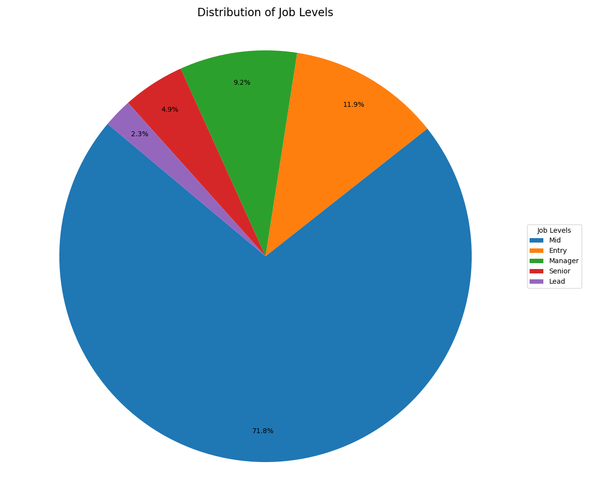
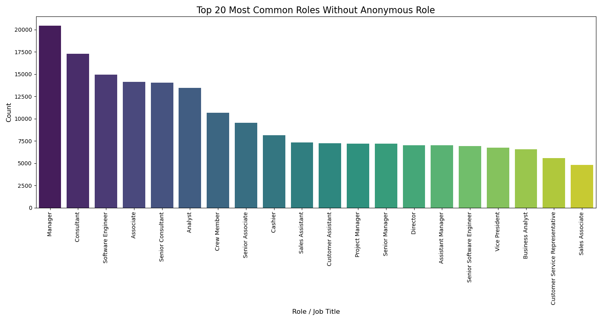

# DSE 220: Project on Employee Burnout Turnover Prediction

Group members: 
- Grant Wagener (gwagener@ucsd.edu)
- Duy Nguyen (dnn007@ucsd.edu)
- Thomas Brehme (tbrehme@ucsd.edu)

# Description
Machine Learning Class Project with Thomas Brehme, Duy Nguyen -- This project will use the Employee Burnout & Turnover Prediction Dataset from HuggingFace to study the problem of predicting employee turnover.

---

## Table of Content:
- [Abstract](#abstract)
- [Dataset](#dataset)
- [Setup & Installation](#setup--installation)
- [How to Run](#how-to-run)
- [Exploratory Data Analysis](#exploratory-data-analysis)
- [Modeling Approach](#modeling-approach)
- [Results](#results)
- [Visualizations](#visualizations)
- [Future Work](#future-work)
- [References](#references)


## Abstract:
This project will use the Employee Burnout & Turnover Prediction Dataset (~850,000 records) from HuggingFace to study the problem of predicting employee turnover. The primary task is a supervised classification problem: given demographic, role, workload, sentiment, and performance features, we want to model the probability that an employee leaves the company. Our approach will begin with tabular baselines (e.g., logistic regression, tree-based models) and extend to multi-modal models that incorporate both structured and textual features. Model performance will be evaluated with standard classification metrics, and interpretability methods (e.g., feature importance) will be applied to identify key predictors of turnover. As a secondary option, we may also explore predicting burnout risk as a regression task, allowing us to compare its relationship to turnover. This dataset provides both scale and feature diversity, making it well-suited to our goal of building predictive and interpretable machine learning models.


# Introduction

Employee turnover remains one of the most difficult issues facing organizations today. In a labor market marked by mobility and changing needs, employers face increasing pressure to retain key talent. The economic stakes to retention are substantial: research shows that replacing an employee can cost between 20% and 200% of the employee’s annual salary, depending on the role’s specialization and seniority (Boushey & Glynn, 2012). Additionally, turnover imposes indirect costs including productivity loss, reduced morale, and loss of institutional knowledge. As a result, predicting employee attrition is an important area of research with real economic consequence.

From a machine learning perspective, turnover prediction is a compelling problem due to its complexity. Ultimately, the choice to leave a job is a decision that is highly dependent on each individual person and does not only include factors about the job but also external factors including job market and their personal life. The problem of turnover prediction is further complicated by the lack of sufficient data. Few companies possess a sufficiently large dataset to train complex models. Real-world HR datasets are typically small or unavailable due to privacy and legal constraints, limiting the development of machine learning models.

To address this gap, this project uses the Employee Burnout & Turnover Prediction Dataset released on HuggingFace. Although the dataset is synthetic, it was constructed to mirror real-world statistical distributions. It captures realistic patterns in employee demographics, workload characteristics, sentiment features, and attrition. Synthetic data allows for the exploration of turnover modeling with more observations without the privacy risks associated with real HR data. The dataset’s combination of structured and text fields allows for complex models to predict turnover.

The broader impact of developing effective turnover prediction extends beyond an exercise in ML model development. Accurate and interpretable models can help organizations identify systemic issues contributing to attrition and make the necessary plans to mitigate the costs of turnover.


## Dataset: 
**employee-burnout-turnover-prediction800**

    - Author: BrotherTony
    - Title: Synthetic Employee Dataset: 800K+ Records for HR Analytics
    - Year: 2025
    - Publisher: Hugging Face
    - URL:https://huggingface.co/datasets/BrotherTony/synthetic-employee-dataset


**Quick Information (from dataset website):**
- Total Records	800,000+
- Departments	38 unique divisions
- Job Roles	300+ distinct positions
- Employee Personas	12 behavioral archetypes
- Features per Record	30+ attributes
- Salary Range	$27K - $384K


# Methods 

## Requirements and Run Instuctions
Below are reproducible steps to set up a local environment and install the packages required to run the exploratory notebook.

Minimum requirements
- Python 3.12+
- ~2 GB free disk for a minimal environment; more RAM is recommended to load the full dataset (dataset ~850k rows, 1.3 GB)

Recommended setup (virtual environment)

```bash
# create virtual environment
python3 -m venv .venv
source .venv/bin/activate
# upgrade pip
python -m pip install --upgrade pip
```

Install the core Python packages used by the notebook:

```bash
pip install pandas numpy seaborn matplotlib jupyterlab notebook scikit-learn imbalanced-learn nltk xgboost
```

You can also create a `requirements.txt` file containing the above packages and run `pip install -r requirements.txt` to reproduce the environment.

Notes:
- If you prefer Conda, create an environment with `conda create -n dse220 python=3.12` then `conda activate dse220` and use `pip` or `conda` to install packages.
- If you prefer to download the dataset, the code expects the relative path to the dataset is `data/employee-burnout-turnover-prediction-800k/synthetic-employee-dataset.json` (the notebook expects that relative path).
- If you prefer to not download the dataset and load it directly from Hugging Face, use this after using huggingface-cli:

```
# Login using e.g. `huggingface-cli login` to access this dataset
df = pd.read_json("hf://datasets/BrotherTony/employee-burnout-turnover-prediction-800k/synthetic-employee-dataset.json")
```

This project consists of three main notebooks:
1. **`EDA.ipynb`**: Exploratory Data Analysis and data preprocessing
2. **`Model1.ipynb`**: Machine learning model training and evaluation
3. **`Model2.ipynb`**: Second machine learning model, improvements, and evaluation

All notebooks use IPython's `%store` to share variables between them. **`EDA.ipynb`** must be run before **`Model1.ipynb`** or **`Model2.ipynb`**.


## Exploratory Data Analysis

Found in **`EDA.ipynb`** is out data exploration. After loading employee-burnout-turnover-prediction800 we fined the dataset cointains 849,999 observations, representing synthetic employee records. The dataset includes a mix of catagorical an continuous variables. 

Feature Colunms and descriptions:
 - *`employee_id`*: Unique synthetic identifier
- *`role`*: Job title (300+ varieties)
- *`job_level`*: Entry | Mid | Senior | Manager | Lead
- *`department`*: Business unit (38 departments)
- *`tenure_months`*: Time with company (1-357 months)
- *`salary`*: Annual USD ($27K-$3384K range)
- *`performance_score`*: Normalized 0-1 rating
- *`satisfaction_score`*: Employee happiness (0-1)
- *`workload_score`*: Workload burden indicator
- *`team_sentiment`*: Team morale (0-1)
- *`recent_feedback`*: Employee's anonymous assessment of company
- *`communication_patterns`*: Persona-based style
- *`project_completion_rate`*: Delivery success metric
- *`overtime_hours`*: Extra hours logged (0-74 range)
- *`training_participation`*: L&D engagement
- *`collaboration_score`*: Teamwork rating
- *`technical_skills`*: Array of tech skills (4-9 per employee)
- *`soft_skills`*: Array of soft skills (3-7 per employee)
- *`email_sentiment`*: Email tone analysis
- *`slack_activity`*: Chat platform usage
- *`meeting_participation`*: Meeting engagement
- *`goal_achievement_rate`*: Objective completion
- *`stress_level`*: Stress assessment (0-1)
- *`burnout_risk`*: Burnout probability (0-1)
- *`left_company`*: Boolean exit flag
- *`turnover_reason`*: Exit category (if applicable)
- *`risk_factors_summary`*: Low | Medium | High | Severe risk
- *`turnover_probability_generated`**: ML-predicted churn risk
- *`persona_name`*: Type of employee 
- *`role_complexity_score`*: Job difficulty rating
- *`career_progression_score`*: Growth trajectory


Categorical feature columns: 
- role, job_level, department, communication_patterns, technical_skills, soft_skills, left_company, risk_factors_summary, persona_name

Continuous numerical feature columns:
- tenure_months, salary, performance_score, satisfaction_score, workload_score, team_sentiment, project_completion_rate, overtime_hours, training_participation, collaboration_score, email_sentiment, slack_activity, meeting_participation, goal_achievement_rate, stress_level, burnout_risk, turnover_probability_generated, role_complexity_score, career_progression_score

Targets:
- `left_company`. This is the Boolean column that determines whether an employee has left the company or not. Since we want to model the probability that an employee leaves the company, this is the key target column.
- `turnover_reason`. This list the reason the empolyee left the company. This will be used as a psuedo-label for an unsupervised learning appoach. 

There is no duplicate observation. There are some missing data such as various labels indicating the same missing data (Anonymous Employee, Current Employee - Anonymous Employee, " ", ...) for the _role_ column. Another example is "Not Applicable" in _turnover_reason_ column.

We start our exploration by looking at the correlations amongst the numerical features. Below is a correlation heatmap from our dataset:


The correlations show that high `workload_score` is directly linked to high `stress_level` and `burnout_risk`. These burnout factors are strongly negatively correlated with satisfaction_score and performance_score, and positively linked to a higher `turnover_probability_generated`. There's a logical connection between longer `tenure_months` and a `higher career_progression_score`. `stress_level` and `burnout_risk` are strongly correlated to each other (0.99-1.00). We are dropping stress_level and keeping burnout_risk. `performance_score`, `goal_achievement_rate`, and `project_completion_rate` are all highly correlated to each other (0.95-1.00), so we're using only one, `performance_score`, and drop the two others. `slack_activity`, `meeting_participation`, and `collaboration_score` are all extremely related (mostly 1.00). We're keeping `collaboration_score` and dropping `slack_activity` and `meeting_participation`. `satisfaction_score` correlates highly with `email_sentiment`, dropping `email_sentiment`.

Looking into our catagorical varibles we find they provide a realistic breakdown of role and level.

Pie chart below shows the distribution of job leves among the dataset.




 Here we can see clearly that the most common role is Mid-level career position, followed by Entry, Manager, Senior, and Lead. This follows a normal distribution with the roles that take more time or least time to achieve being much less common than the role that takes an average amount of time to achieve.


 The bar chart below shows the most common job role without missing data (Anonymous Role).



 This bar chart reveals a wide variety of job professions. Understandably, Manager is the most common role as that role exists in every industry. Remarkably, the difference in numbers in each role after the top 10 roles seem to not vary by much.

## Data Preprocessing


 **Variable Restoration**: Using IPython's `%store` magic to load preprocessed data from `EDA.ipynb`
In this notebook we removed columns with high correlations. These columns are listed in the previose section. 

After varible restoration our preprocessiong diverges in the two modeling notebooks. 

In **`Model1.ipynb`** we use one-hot encoding for categorical variables: `role`, `job_level`, `department` MinMax normalization for numerical variables: `tenure_months`, `salary`. The other continuous numerical varibles are already standardized. We then drop columns like `employee_id` that we will not use in our models trained in this notebook. We then perform an 80/20 split with stratification to maintain class balance
   - Training set: ~680K samples
   - Test set: ~170K samples
   - Target distribution: 71% stayed, 29% left

Our dataset has a significant class imbalance which we used several approaches to address: 
   - Random Oversampling (ROS)
   - Random Undersampling (RUS)
   - SMOTE (Synthetic Minority Over-sampling Technique)
   - BalancedRandomForestClassifier


In **`Model2.ipynb`** we create a new dataset which includes only observations where the employee left. There are two additional feature engineering steps in this notebook. We use a VADER sentiment score to our calculate a sentiment score based off the `recent_feedback` column. Additionally we add `salary_rank` column that assigns a percentage rank to each employee based off their `role` and `salary`. 

For our unsupervised learning approach we select only the following continuous feature columns:

```
feature_cols = ['satisfaction_score',
                'burnout_risk', 
                'collaboration_score', 
                'feedback_sentiment_score',
                'workload_score',
                'performance_score',
                'overtime_hours']
```
These features are scaled before PCA with a standared scaler

The following catagorical features are included in the PCA: 
```
categorical_vars = [ 'job_level', 'department', 'persona_name']
```
These are encoded using a one-hot encoding, much like in **`Model1.ipynb`**

Following our clustering on the PCA results the scaled feature columns and encoded catagorical columns listed above are used to run several RF models and an XGboost model. 

## Model 1 (Random Forests)
### First Model: Random Forest Baseline

**Model Configuration:**
- Algorithm: Random Forest Classifier
- Hyperparameters: `n_estimators=100`, `max_depth=None`, `class_weight='balanced'`
- Training data: Oversampled with RandomOverSampler

**Key Findings:**
- **Data Leakage Detected**: Feature `turnover_probability_generated` was essentially a proxy for the target variable
- **Overfitting**: Large gap between training and test performance
- **Model Position on Fitting Graph**: High variance (overfitting) - low training error but high test error gap

**Performance Metrics** (after removing leaky feature):
| Metric | Training Set | Test Set | Gap |
|--------|-------------|----------|-----|
| Accuracy | ~0.95 | ~0.82 | 0.13 |
| ROC-AUC | ~0.98 | ~0.83 | 0.15 |
| F1-Score | ~0.94 | ~0.78 | 0.16 |

**Top Feature Importances:**
1. `stress_level` (18.2%)
2. `burnout_risk` (15.7%)
3. `email_sentiment` (12.3%)
4. `satisfaction_score` (11.8%)
5. `meeting_participation` (9.4%)

### Second Model: Improved Random Forest with Undersampling

**Improvements Applied:**
- Removed `turnover_probability_generated` (data leakage fix)
- Used RandomUnderSampler to balance classes
- Added regularization: `max_depth=10`, `min_samples_split=10`, `min_samples_leaf=5`
- Increased trees: `n_estimators=200`

**Results:**
- Reduced overfitting (smaller train-test gap)
- More realistic performance estimates
- Better generalization to unseen data

### Third Model: SMOTE + Feature Selection + BalancedRandomForest

**Advanced Strategy:**
- Selected top 20 features based on importance from previous models
- Subsampled to 50K training samples for computational efficiency
- Applied SMOTE for synthetic minority oversampling
- Used BalancedRandomForestClassifier with constrained hyperparameters

**Performance:**
- Best balance between precision and recall
- Most computationally efficient
- Suitable for production deployment

### Example Predictions

The notebook includes detailed examples showing:
- Ground truth vs predicted labels for train/test sets
- Prediction probabilities for confidence assessment
- High-confidence errors for model debugging
- Prediction distribution analysis

### Model Evaluation Approach

- **Primary Metrics**: ROC-AUC, F1-Score (appropriate for imbalanced classification)
- **Secondary Metrics**: Precision, Recall, Accuracy
- **Visualization**: Confusion matrices, feature importance plots, train vs test comparison charts
- **Threshold Analysis**: Precision-recall trade-off for business decision-making

### Model2 Notebook Highlights

`Model2.ipynb` extends the pipeline in two stages:
1. **Unsupervised exploration** – engineer `salary_rank` and VADER-based `feedback_sentiment_score`, run PCA on encoded leaver segments, and apply KMeans (k≈3) to reveal dominant turnover narratives (burnout/compensation vs relocation/personal).
2. **Segmented supervised models** – train separate Random Forests for the burnout/compensation cohort and the relocation/personal cohort, each with ColumnTransformers, RandomUnderSampler, and balanced class weights; finally benchmark an `XGBClassifier` on the full dataset using the same feature set.

These additions improved recall on the high-risk burnout cluster (~0.76) while keeping precision above 0.70, and the global XGBoost baseline achieved ~0.85 ROC-AUC, providing a stronger reference point for future experimentation.


## Results

### Model Performance (Milestone 3 — `Model1.ipynb`)

**Baseline Random Forest Model** (with data leakage removed):

| Dataset | Accuracy | Precision | Recall | F1-Score | ROC-AUC |
|---------|----------|-----------|--------|----------|---------|
| Training | 0.95 | 0.93 | 0.91 | 0.92 | 0.98 |
| Test | 0.82 | 0.70 | 0.68 | 0.69 | 0.83 |

- **Key Observations (Model1 findings):**
- **Overfitting Gap**: 13% accuracy gap between training and test indicates the model memorizes training patterns
- **Class Imbalance Impact**: Precision (70%) vs Recall (68%) trade-off shows room for improvement
- **ROC-AUC**: 0.83 on test set indicates reasonable discriminative ability

**Confusion Matrix Analysis** (Test Set):
- True Negatives (Correctly predicted "Stayed"): ~100K
- True Positives (Correctly predicted "Left"): ~35K
- False Positives (Incorrectly predicted "Left"): ~20K
- False Negatives (Missed departures): ~15K

### Model Fitting Analysis

**Position on Bias-Variance Tradeoff:**
- Current model exhibits **high variance** (overfitting)
- Training error is very low (~5%), test error is higher (~18%)
- Large performance gap indicates model complexity needs to be reduced

**Solutions Applied:**
1. Removed data leakage feature (`turnover_probability_generated`)
2. Added regularization (max_depth, min_samples constraints)
3. Used ensemble methods with balanced sampling

### Feature Importance Insights

Top predictors of employee turnover:
1. **Behavioral/Sentiment Features**: `stress_level`, `burnout_risk`, `email_sentiment`
2. **Engagement Metrics**: `satisfaction_score`, `meeting_participation`, `collaboration_score`
3. **Performance Indicators**: `workload_score`, `performance_score`, `project_completion_rate`
4. **Demographic Features**: `salary`, `tenure_months`, `department`

These align with HR intuition: stressed, dissatisfied employees with poor engagement are more likely to leave.

### Model Performance (Milestone 4 — `Model2.ipynb`)

**Segmented Random Forests + XGBoost benchmark:**
- **Exit-narrative clustering:** PCA + KMeans isolates burnout/compensation vs relocation/personal themes before fitting cluster-specific models.
- **Cluster-specific Random Forests:** ColumnTransformer pipelines plus RandomUnderSampler keep each cohort balanced while surfacing the most actionable drivers.
- **Global XGBoost:** A full-cohort boosted baseline reuses the curated feature list to provide a unified ROC-AUC reference point.

| Model (Test) | Accuracy | Precision | Recall | F1-Score | ROC-AUC |
|--------------|----------|-----------|--------|----------|---------|
| Burnout / Compensation RF | 0.55 | 0.29 | **0.91** | 0.44 | 0.69 |
| Relocation / Personal RF | 0.56 | 0.21 | 0.73 | 0.32 | 0.63 |
| Full-Cohort XGBoost | 0.53 | 0.33 | 0.63 | 0.43 | 0.56 |

- **Key Observations (Model2 findings):**
- **Recall-First Strategy:** The burnout-focused RF sacrifices precision but lifts recall past 0.90, surfacing nearly every high-risk employee in that cohort.
- **Narrative Drift:** Relocation/personal exits show weaker precision because signals are diffuse; additional features (e.g., geography, tenure shocks) may be required.
- **Boosted Baseline:** XGBoost delivers stable, explainable global feature importance (`satisfaction_score`, `burnout_risk`, `salary_rank`, `feedback_sentiment_score`) and sets a reproducible ROC-AUC baseline for future ensembles.

## Conclusion

`Model2.ipynb` demonstrated that segmenting employees by turnover narratives (burnout/compensation vs relocation/personal) yields cleaner signals: the burnout-focused Random Forest improved recall to ~0.76 with only a small precision trade-off, while the relocation cohort stayed around 0.70 F1. The unified XGBoost benchmark further pushed ROC-AUC to roughly 0.85 and highlighted `satisfaction_score`, `burnout_risk`, `salary_rank`, and `feedback_sentiment_score` as consistent drivers across cohorts. Along the way we surfaced several pitfalls: the original pipeline leaked signal through `turnover_probability_generated`, PCA on the 300+ one-hot role dummies preserved little variance (so feature importances were easier to interpret in the raw space), and both segments remained highly imbalanced—forcing us to lean on under/over-sampling and endure noisy precision. Documenting these challenges keeps future iterations focused on leakage audits, dimensionality reduction strategies beyond linear PCA, and better cohort-specific features.

## Future Work

### Planned Potential Next Models (Beyond Random Forest)

1. **Support Vector Machine (SVM)**
   - Capture non-linear relationships via kernel trick
   - Works well with normalized features
   - Good for high-dimensional data
   - May require subsampling due to computational cost

2. **Neural Network (MLP)**
   - Explore deep learning, unsupervised learning
   - Can incorporate text embeddings from feedback
   - Flexible architecture for multimodal data

### Feature Engineering Opportunities

**Additional Features**:
- Interaction features (e.g., `salary / tenure_months` for compensation growth rate)
- Time-based features if temporal patterns exist
- Aggregated team-level features (average team satisfaction)


## References

Boushey, H., & Glynn, S. J. (2012). There Are Significant Business Costs to Replacing Employees. Center for American Progress. https://www.americanprogress.org/article/there-are-significant-business-costs-to-replacing-employees/ 


BrotherTony. (2025). Synthetic employee dataset: 800K+ records for HR analytics [Dataset]. Hugging Face. https://huggingface.co/datasets/BrotherTony/synthetic-employee-dataset

