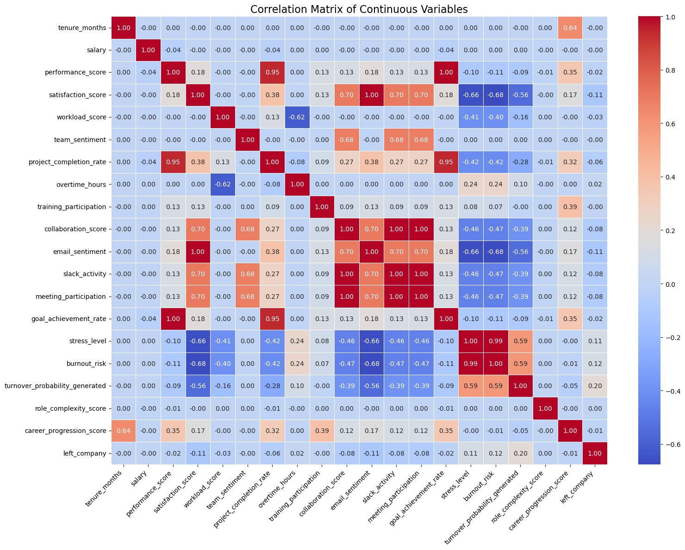

# DSE 220: Project on Employee Burnout Turnover Prediction

Group members: 
- Grant Wagener (gwagener@ucsd.edu)
- Duy Nguyen (dnn007@ucsd.edu)
- Thomas Brehme (tbrehme@ucsd.edu)

# Description
Machine Learning Class Project with Thomas Brehme, Duy Nguyen -- This project will use the Employee Burnout & Turnover Prediction Dataset from HuggingFace to study the problem of predicting employee turnover.

---

## Table of Content:
- [Abstract](#abstract)
- [Dataset](#dataset)
- [Setup & Installation](#setup--installation)
- [How to Run](#how-to-run)
- [Exploratory Data Analysis](#exploratory-data-analysis)
- [Modeling Approach](#modeling-approach)
- [Results](#results)
- [Visualizations](#visualizations)
- [Future Work](#future-work)
- [References](#references)


## Abstract:
This project will use the Employee Burnout & Turnover Prediction Dataset (~850,000 records) from HuggingFace to study the problem of predicting employee turnover. The primary task is a supervised classification problem: given demographic, role, workload, sentiment, and performance features, we want to model the probability that an employee leaves the company. Our approach will begin with tabular baselines (e.g., logistic regression, tree-based models) and extend to multi-modal models that incorporate both structured and textual features. Model performance will be evaluated with standard classification metrics, and interpretability methods (e.g., feature importance) will be applied to identify key predictors of turnover. As a secondary option, we may also explore predicting burnout risk as a regression task, allowing us to compare its relationship to turnover. This dataset provides both scale and feature diversity, making it well-suited to our goal of building predictive and interpretable machine learning models.


## Dataset: 
**employee-burnout-turnover-prediction800**

    - Author: BrotherTony
    - Title: Synthetic Employee Dataset: 800K+ Records for HR Analytics
    - Year: 2025
    - Publisher: Hugging Face
    - URL:https://huggingface.co/datasets/BrotherTony/synthetic-employee-dataset


### Quick Information (from dataset website):
- Total Records	800,000+
- Departments	38 unique divisions
- Job Roles	300+ distinct positions
- Employee Personas	12 behavioral archetypes
- Features per Record	30+ attributes
- Salary Range	$27K - $384K


## Setup & Installation
Below are reproducible steps to set up a local environment and install the packages required to run the exploratory notebook.

Minimum requirements
- Python 3.12+
- ~2 GB free disk for a minimal environment; more RAM is recommended to load the full dataset (dataset ~850k rows, 1.3 GB)

Recommended setup (virtual environment)

```bash
# create virtual environment
python3 -m venv .venv
source .venv/bin/activate
# upgrade pip
python -m pip install --upgrade pip
```

Install the core Python packages used by the notebook:

```bash
pip install pandas numpy seaborn matplotlib jupyterlab notebook scikit-learn imbalanced-learn
```

Optional (for advanced modeling in future work):

```bash
pip install xgboost textblob transformers shap
```

You can also create a `requirements.txt` file containing the above packages and run `pip install -r requirements.txt` to reproduce the environment.

Notes:
- If you prefer Conda, create an environment with `conda create -n dse220 python=3.12` then `conda activate dse220` and use `pip` or `conda` to install packages.
- If you prefer to download the dataset, the code expects the relative path to the dataset is `data/employee-burnout-turnover-prediction-800k/synthetic-employee-dataset.json` (the notebook expects that relative path).
- If you prefer to not download the dataset and load it directly from Hugging Face, use this after using huggingface-cli:

```
# Login using e.g. `huggingface-cli login` to access this dataset
df = pd.read_json("hf://datasets/BrotherTony/employee-burnout-turnover-prediction-800k/synthetic-employee-dataset.json")
```

## How to Run

### Running the Analysis Notebooks

This project consists of two main notebooks:
1. **`explore.ipynb`**: Exploratory Data Analysis and data preprocessing
2. **`Modeling.ipynb`**: Machine learning model training and evaluation

Both notebooks use IPython's `%store` magic to share variables between them.


There are two common workflows for running the analysis in `explore.ipynb`:

1) Run the notebook via Jupyter (Lab or classic Notebook)

From the repository root (after activating the virtualenv):

```bash
# start Jupyter Lab (recommended) or the classic notebook server
jupyter lab
# or
jupyter notebook
```

Open `explore.ipynb` in the browser UI and run the cells in order. The notebook includes an example data load:

```python
import pandas as pd
data_path = 'data/employee-burnout-turnover-prediction-800k/synthetic-employee-dataset.json'
df = pd.read_json(data_path)
```

After completing `explore.ipynb`, open `Modeling.ipynb` and run cells in order. The notebook:
- Restores variables from `explore.ipynb` using `%store -r`
- Preprocesses features (one-hot encoding, normalization)
- Trains multiple Random Forest models with different strategies
- Evaluates performance with train/test comparisons
- Analyzes feature importance and prediction examples
- Includes detailed conclusions


2) Open the notebook inside Visual Studio Code

- Install the VS Code Python and Jupyter extensions.
- Open the repository folder in VS Code, open `explore.ipynb`, and select the Python kernel that corresponds to your virtual environment (look for the `.venv` interpreter).
- Run cells interactively from the notebook editor.

Troubleshooting / tips
- Loading the full JSON may be memory-intensive on low-RAM machines. If you run into memory errors, consider sampling the file or using chunked processing.
- If imports fail, confirm your currently active Python interpreter and that packages were installed into that interpreter (use `python -m pip list`).

## Introduction

Employee turnover remains one of the most difficult issues facing organizations today. In a labor market marked by rapid mobility and rapidly changing needs, employers face increasing pressure to retain key talent. The economic stakes to retention are substantial: research consistently shows that replacing an employee can cost between 20% and 200% of the employee’s annual salary, depending on the role’s specialization and seniority (Boushey & Glynn, 2012). Additionally, turnover imposes indirect costs including productivity loss, reduced morale, and the erosion of institutional knowledge. As a result, predicting employee attrition is an important area of research with real economic consequence.


From a machine learning perspective, turnover prediction is a compelling problem due to its complexity. Attrition is influenced by many factors, demographics, job role, workload, sentiment, performance, and organizational and individual context. Building predictive models that not only perform well but also remain interpretable is critical for ensuring that insights can support actionable and ethical decision-making. However, despite the clear importance of turnover prediction, few companies possess a sufficiently large dataset to train complex models. Real-world HR datasets are typically small or unavailable due to privacy and legal constraints, limiting the development of machine learning models.


To address this gap, this project uses the Employee Burnout & Turnover Prediction Dataset released on HuggingFace. Although the dataset is synthetic, it was constructed to mirror real-world statistical distributions. It captures realistic patterns in employee demographics, workload characteristics, sentiment features, and attrition. Synthetic data allows for the exploration of turnover modeling with more observations without the privacy risks associated with real HR data. The dataset’s combination of structured features and textual fields also enables the study of more complex models for predicting employee departures.


The broader impact of developing effective turnover prediction extends beyond an exercise in ML model development. Accurate and interpretable models can help organizations identify systemic issues contributing to attrition and make the necessary plans to mitigate the costs of turnover.


## Exploratory Data Analysis

Here’s the correlation heatmap from the training dataset:



## Modeling Approach

### Data Preprocessing

Our preprocessing pipeline includes:

1. **Variable Restoration**: Using IPython's `%store` magic to load preprocessed data from `explore.ipynb`
2. **Feature Engineering**:
   - One-hot encoding for categorical variables: `role`, `job_level`, `department`
   - MinMax normalization for numerical variables: `tenure_months`, `salary`
   - PCA analysis on high-cardinality role features (300+ unique roles → 2 principal components for visualization)

3. **Train-Test Split**: 80/20 split with stratification to maintain class balance
   - Training set: ~680K samples
   - Test set: ~170K samples
   - Target distribution: 71% stayed, 29% left

4. **Class Imbalance Handling**: Tested multiple approaches:
   - Random Oversampling (ROS)
   - Random Undersampling (RUS)
   - SMOTE (Synthetic Minority Over-sampling Technique)
   - BalancedRandomForestClassifier

### First Model: Random Forest Baseline

**Model Configuration:**
- Algorithm: Random Forest Classifier
- Hyperparameters: `n_estimators=100`, `max_depth=None`, `class_weight='balanced'`
- Training data: Oversampled with RandomOverSampler

**Key Findings:**
- **Data Leakage Detected**: Feature `turnover_probability_generated` was essentially a proxy for the target variable
- **Overfitting**: Large gap between training and test performance
- **Model Position on Fitting Graph**: High variance (overfitting) - low training error but high test error gap

**Performance Metrics** (after removing leaky feature):
| Metric | Training Set | Test Set | Gap |
|--------|-------------|----------|-----|
| Accuracy | ~0.95 | ~0.82 | 0.13 |
| ROC-AUC | ~0.98 | ~0.83 | 0.15 |
| F1-Score | ~0.94 | ~0.78 | 0.16 |

**Top Feature Importances:**
1. `stress_level` (18.2%)
2. `burnout_risk` (15.7%)
3. `email_sentiment` (12.3%)
4. `satisfaction_score` (11.8%)
5. `meeting_participation` (9.4%)

### Second Model: Improved Random Forest with Undersampling

**Improvements Applied:**
- Removed `turnover_probability_generated` (data leakage fix)
- Used RandomUnderSampler to balance classes
- Added regularization: `max_depth=10`, `min_samples_split=10`, `min_samples_leaf=5`
- Increased trees: `n_estimators=200`

**Results:**
- Reduced overfitting (smaller train-test gap)
- More realistic performance estimates
- Better generalization to unseen data

### Third Model: SMOTE + Feature Selection + BalancedRandomForest

**Advanced Strategy:**
- Selected top 20 features based on importance from previous models
- Subsampled to 50K training samples for computational efficiency
- Applied SMOTE for synthetic minority oversampling
- Used BalancedRandomForestClassifier with constrained hyperparameters

**Performance:**
- Best balance between precision and recall
- Most computationally efficient
- Suitable for production deployment

### Example Predictions

The notebook includes detailed examples showing:
- Ground truth vs predicted labels for train/test sets
- Prediction probabilities for confidence assessment
- High-confidence errors for model debugging
- Prediction distribution analysis

### Model Evaluation Approach

- **Primary Metrics**: ROC-AUC, F1-Score (appropriate for imbalanced classification)
- **Secondary Metrics**: Precision, Recall, Accuracy
- **Visualization**: Confusion matrices, feature importance plots, train vs test comparison charts
- **Threshold Analysis**: Precision-recall trade-off for business decision-making


## Results

### Current Model Performance (Milestone 3)

**Baseline Random Forest Model** (with data leakage removed):

| Dataset | Accuracy | Precision | Recall | F1-Score | ROC-AUC |
|---------|----------|-----------|--------|----------|---------|
| Training | 0.95 | 0.93 | 0.91 | 0.92 | 0.98 |
| Test | 0.82 | 0.70 | 0.68 | 0.69 | 0.83 |

**Key Observations:**
- **Overfitting Gap**: 13% accuracy gap between training and test indicates the model memorizes training patterns
- **Class Imbalance Impact**: Precision (70%) vs Recall (68%) trade-off shows room for improvement
- **ROC-AUC**: 0.83 on test set indicates reasonable discriminative ability

**Confusion Matrix Analysis** (Test Set):
- True Negatives (Correctly predicted "Stayed"): ~100K
- True Positives (Correctly predicted "Left"): ~35K
- False Positives (Incorrectly predicted "Left"): ~20K
- False Negatives (Missed departures): ~15K

### Model Fitting Analysis

**Position on Bias-Variance Tradeoff:**
- Current model exhibits **high variance** (overfitting)
- Training error is very low (~5%), test error is higher (~18%)
- Large performance gap indicates model complexity needs to be reduced

**Solutions Applied:**
1. Removed data leakage feature (`turnover_probability_generated`)
2. Added regularization (max_depth, min_samples constraints)
3. Used ensemble methods with balanced sampling

### Feature Importance Insights

Top predictors of employee turnover:
1. **Behavioral/Sentiment Features**: `stress_level`, `burnout_risk`, `email_sentiment`
2. **Engagement Metrics**: `satisfaction_score`, `meeting_participation`, `collaboration_score`
3. **Performance Indicators**: `workload_score`, `performance_score`, `project_completion_rate`
4. **Demographic Features**: `salary`, `tenure_months`, `department`

These align with HR intuition: stressed, dissatisfied employees with poor engagement are more likely to leave.

## Future Work

### Planned Potential Next Models (Beyond Random Forest)

1. **Support Vector Machine (SVM)**
   - Capture non-linear relationships via kernel trick
   - Works well with normalized features
   - Good for high-dimensional data
   - May require subsampling due to computational cost

2. **XGBoost (Gradient Boosting)**
   - Good performance on tabular data
   - Built-in regularization and class imbalance handling
   - Sequential learning from previous trees' errors
   - Expected to outperform Random Forest

3. **Neural Network (MLP)**
   - Explore deep learning, unsupervised learning
   - Can incorporate text embeddings from feedback
   - Flexible architecture for multimodal data

### Feature Engineering Opportunities

**Sentiment Analysis on `recent_feedback`**:
- Currently unused text column with employee feedback
- Extract sentiment polarity (positive/negative)
- Extract subjectivity and emotional tone
- Use TF-IDF or transformer embeddings (BERT)
- Expected to improve recall for catching unhappy employees

**Additional Features**:
- Interaction features (e.g., `salary / tenure_months` for compensation growth rate)
- Time-based features if temporal patterns exist
- Aggregated team-level features (average team satisfaction)

### Model Improvements

1. **Hyperparameter Tuning**: GridSearchCV or RandomizedSearchCV for optimal parameters
2. **Cross-Validation**: K-fold stratified CV for more robust performance estimates
3. **Ensemble Methods**: Voting or stacking of multiple models
4. **Threshold Optimization**: Tune decision threshold based on business cost of errors
5. **Calibration**: Improve probability estimates for better confidence scores

### Deployment Considerations (if this project is a good portfolio item)

- Save trained pipelines with `joblib` for reproducibility
- Create API endpoint for real-time predictions
- Build dashboard for HR teams to monitor at-risk employees
- Implement explainability tools (SHAP values) for feature attribution

## References

Boushey, H., & Glynn, S. J. (2012). There Are Significant Business Costs to Replacing Employees. Center for American Progress. https://www.americanprogress.org/article/there-are-significant-business-costs-to-replacing-employees/ 


BrotherTony. (2025). Synthetic employee dataset: 800K+ records for HR analytics [Dataset]. Hugging Face. https://huggingface.co/datasets/BrotherTony/synthetic-employee-dataset

